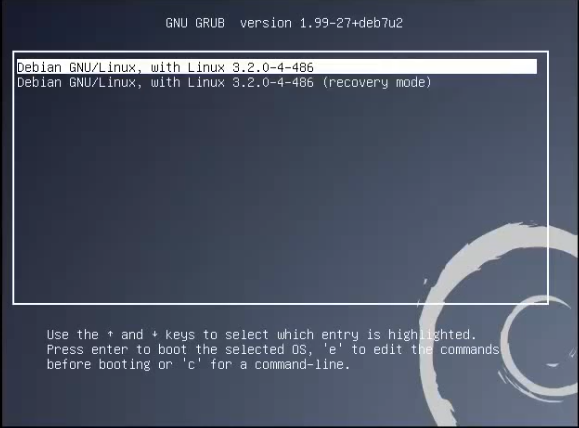
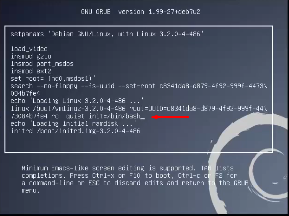
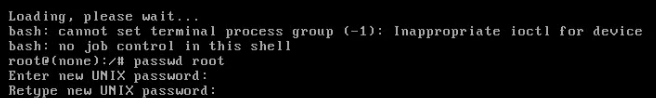
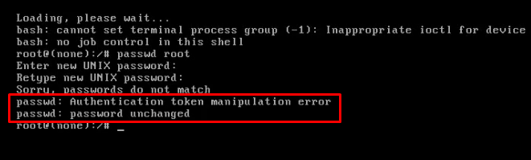
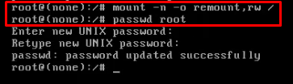

# Cambiar contraseña de root

1. En **GNU GRUB** seleccionamos la distribución de linux que deseamos editar y presionamos la tecla **e**.

   

2. En la línea **73084b7fe4 ro quiet** agregar **init=/bin/bash**.

   

3. Presionamos **F10** para iniciar el sistema.
4. Escribimos en **root(none):/#**, el comando **passwd root**.

   

5. En caso de que no podamos modificar la contraseña debemos volver a montar la unidad, otorgándole permisos de lectura y escritura.

   

6. Utilizamos el comando **mount -n -o remount, rw /**.

   

7. Volvemos a ejecutar el comando **passwd root**.
8. Para volver a reiniciar el sistema una vez cambiada la contraseña damos **Crtl + Alt + Del**.
